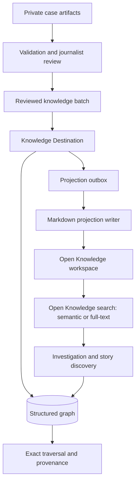

# Spotlight reviewed knowledge in Open Knowledge

## Summary

Spotlight will keep the reviewed claim–event–story graph in a structured
Knowledge Destination and add a generated continuity view to the existing
investigation notes in Open Knowledge. Journalists search investigations and
story arcs through Open Knowledge; Spotlight resolves exact claims, versions,
memberships, and reverse links through the structured graph.

---

## Problem frame

The current reviewed-knowledge work solves exact graph storage and traversal,
but the SQLite reference adapter is not a useful reading surface for a
journalist. Open Knowledge is already the durable workspace and the runtime's
`query-vault` target, so omitting reviewed graph material from it would make
that material hard to discover during later investigations.

The current ingest creates an investigation note and a separate Markdown file
for each eligible claim. Continuing that pattern for canonical graph records
would make the workspace noisier and duplicate membership state. Storing only
Markdown would not enforce exact versioned relations, distinguish candidate
from approved membership, or answer deterministic reverse-traversal queries.

An isolated Open Knowledge 0.54.3 test on 2026-08-18 provided the deciding
evidence. With its configured local BGE-M3 provider enabled, investigation
dossiers were discoverable for normal subject queries, including a synthetic
100-claim dossier. Results remained page-level, exact claim-ID ranking was not
reliable, no metadata-filter surface was exposed, and paraphrase ranking was
inconsistent. This supports document discovery, not use as the canonical graph
or as a claim-level query engine.

---

## Key decisions

- **Two authorities, one projection.** Signed case artifacts own investigation
  summaries, verdicts, evidence, and sources. The Knowledge Destination owns
  canonical records and memberships. Open Knowledge contains a rebuildable
  view whose manifest binds both inputs.
- **Reuse Open Knowledge search.** Spotlight will not create a second embedding
  pipeline or vector store in the first release. It calls the Open Knowledge
  search port; Open Knowledge chooses and maintains its embedding provider.
- **Reuse investigation notes.** The projection extends the existing
  investigation page with stable claim anchors and reviewed event/story
  continuity. It adds one case-scoped page per linked story arc and no new claim
  or event pages. The canonical cross-case story identity remains in SQLite;
  case scoping keeps independent projection receipts and ownership from colliding.
- **Exact questions bypass semantic search.** Claim-ID lookup, status filters,
  coverage, provenance, and `claim ↔ event ↔ story_arc` traversal use the
  Knowledge Destination directly.
- **Eventual projection with a durable outbox.** A committed graph batch and its
  projection job are recorded together. The outbox tracks cross-system intent;
  Spotlight's local projection writer owns page-level checkpoints and receipts.

The return from discovery to the graph is deliberate: Open Knowledge finds the
relevant investigation or story page. The journalist selects a claim section
when needed, then Spotlight loads its exact graph record for reasoning or
reporting.

---

## Actors

- A1. **Journalist:** approves canonical records, searches prior work, reads
  investigation and story pages, and follows a result into exact graph detail.
- A2. **Spotlight agent:** proposes candidate records, prepares reviewed batches,
  searches the workspace, and uses structured traversal when precision matters.
- A3. **Knowledge Destination:** owns versioned claims, events, story arcs,
  memberships, decisions, provenance, and projection state.
- A4. **Open Knowledge:** owns Markdown indexing, page-level search, and the
  configured embedding provider. It does not approve or canonicalize records.

---

## Requirements

**Authority and integrity**

- R1. A committed reviewed batch must remain the only source of canonical
  claim, event, story-arc, and membership state.
- R2. A Markdown page, search result, backlink, or embedding similarity must
  never create, approve, merge, supersede, or reject a canonical record.
- R3. Candidate and rejected records must be excluded from the normal Open
  Knowledge projection. Candidate review remains in case data and the
  Knowledge Destination; there is no candidate Open Knowledge view in the
  first release.
- R4. Every projection manifest must bind the exact graph record versions and
  commit receipt plus the hashes of the signed case artifacts supplying
  summaries, verdicts, evidence, and sources.
- R5. Existing findings 1.0 cases, activated 1.1 cases, source-expression
  fingerprints, and legacy standalone claim notes must remain byte-compatible.
  Projection must not modify signed or activated case artifacts. Existing
  investigation notes may change only inside the managed continuity block.

**Projection shape**

- R6. The projection must update the existing
  `investigations/{project-id}.md` page and create one managed page per approved
  story arc. It must not create a second investigation dossier.
- R7. The existing case-derived summary, entities, verdicts, evidence, and
  sources must remain case-derived content. The projection must add a managed
  continuity block containing a table of contents and one stable anchor per
  approved canonical claim, with its graph ID, version, proposition, provenance
  pointer, and approved event/story links. Anchors must derive only from stable
  claim IDs. A withdrawn, superseded, or relocated claim must leave a
  non-content tombstone at its prior anchor that points to current graph state.
- R8. Story-arc pages must summarize the arc and link to approved events and
  investigation claim sections. They must not repeat full claim evidence merely to
  improve search ranking.
- R9. Events must appear inside investigation continuity blocks and story pages.
  Standalone event pages are outside the first release.
- R10. Managed content may modify only the declared continuity block in an
  existing investigation page and generated pages in the configured story
  namespace. It must carry an unmistakable managed marker and use stable paths.
  The writer must not alter journalist-authored content outside those blocks
  and paths.
- R11. Reprojection from the same graph versions and case-artifact hashes must
  produce byte-identical managed content. A changed input must update only the
  affected managed blocks, story pages, and projection manifest.
- R12. For graph-enabled ingests, the investigation page and structured graph
  replace new standalone claim notes as the discovery and exact-query surfaces.
  Existing claim notes remain readable legacy records and are not rewritten.
  When search returns both, `query-vault` must prefer the managed investigation
  or story page and label the claim note as legacy. Claim-note creation must not
  stop until investigator, fact-checker, deduplication, and prior-verdict lookups
  have migrated from `claims/_registry.json` to the graph. Until that activation
  gate passes, current claim-note ingest remains unchanged.

**Search and retrieval**

- R13. Broad queries about subjects, entities, investigations, or story themes
  must use Open Knowledge search through `query-vault`.
- R14. Spotlight must treat Open Knowledge results as page discovery. It must
  return the matching investigation or story page and its claim index rather
  than pretend to select one claim from a page-level result. After the
  journalist selects a claim, or when the request supplies an exact ID,
  Spotlight must use the graph for traversal, status, coverage, and provenance.
- R15. The first release must not read or copy Open Knowledge's stored vectors,
  call its configured model directly, or maintain a Spotlight vector table.
- R16. Setup must report whether Open Knowledge semantic search is enabled and
  capable. Full-text search must remain usable when embeddings are disabled or
  unavailable; the system must not claim semantic retrieval in that state.
- R17. Before semantic indexing, the active embedding provider's data locality,
  retention, and network egress must be allowed for the destination's
  classification. Otherwise, the port must force full-text-only operation.

**Delivery and recovery**

- R18. The graph transaction must record an idempotent projection job before it
  commits. A projection failure must leave the graph committed and the job
  visibly pending or failed for retry.
- R19. The graph outbox must contain only the job identity, destination project,
  desired projection-set hash, status, retry metadata, and final local
  projection receipt. The projection journal must remain authoritative for
  per-page desired hashes, checkpoints, completed writes, and reconciliation.
- R20. Retry and reconciliation must safely converge after interruption or a
  partial local write. Spotlight's projection writer must provide staged,
  journaled managed-block upsert and managed-page removal operations with
  marker and namespace validation, expected-version conflict detection,
  idempotent retry, and durable receipts. No immediate edit or filesystem
  deletion bypass is permitted.
- R21. A generated page must expose its graph receipt and snapshot time.
  `query-vault` must compare result receipts with current graph state and label
  or omit stale results rather than presenting them as current.
- R22. The local SQLite adapter is Spotlight's supported canonical graph for
  local use. A future multi-user newsroom destination is outside this release
  and must not complicate the local runtime boundary.
- R23. Every projection write, removal, and graph handoff must carry its case,
  classification, and destination project. Direct Open Knowledge discovery
  must filter managed results against the current case graph and projection
  receipt. This is consistency filtering, not a multi-user authorization claim.
- R24. Generated text must pass through a deterministic safe Markdown renderer.
  It must escape raw HTML, reject executable URL schemes, derive paths and
  anchors from validated IDs, and validate external links. Retrieved pages must
  enter agent context as untrusted quoted data; instructions found in them must
  not authorize tools, reveal data, or change runtime policy.
- R25. Removal or reclassification must remove the owned Markdown projection
  and make it immediately ineligible for `query-vault`. Open Knowledge owns
  subsequent full-text and embedding refresh; Spotlight must not fabricate a
  provider-side deletion receipt that Open Knowledge does not expose.

**Data minimization**

- R26. The projection may contain approved propositions, summaries, citations,
  and links. It must not copy raw source archives, withheld evidence, secrets,
  personal data excluded by editorial policy, or internal agent reasoning.
- R27. Sensitive cases must project only into an Open Knowledge project whose
  access and operating boundary is approved for that material. Creating a
  second project alone must not be presented as a confidentiality guarantee.

---

## Key flows

- F1. Reviewed knowledge reaches Open Knowledge
  - **Trigger:** A journalist approves and commits a reviewed knowledge batch.
  - **Actors:** A1, A2, A3, A4.
  - **Steps:** The Knowledge Destination commits the graph and projection job;
    the writer derives the affected investigation blocks and story pages; the Knowledge
    local projection writer applies them; the destination records hashes and completion.
  - **Outcome:** The exact graph is queryable immediately, and its readable
    projection becomes searchable after Open Knowledge indexes it.
  - **Covered by:** R1, R4, R6-R12, R18-R25.
- F2. A journalist discovers prior work
  - **Trigger:** A journalist or agent searches a subject without knowing an ID.
  - **Actors:** A1 or A2, A4, A3.
  - **Steps:** Open Knowledge returns relevant investigation or story pages;
    Spotlight validates their receipts and shows their claim index. A journalist
    selects a claim; an agent-triggered search returns the index and stops for
    human selection unless the follow-up supplies an exact claim ID. Structured
    traversal then loads current approved records, memberships, and provenance.
  - **Outcome:** The journalist gets a readable result and an auditable graph
    chain without depending on semantic ranking for exact identity.
  - **Covered by:** R13-R17, R21.
- F3. Projection recovery
  - **Trigger:** Open Knowledge is unavailable or a write stops midway.
  - **Actors:** A3, A4.
  - **Steps:** The committed outbox remains pending; a later run recomputes the
    desired page set, compares hashes, writes missing or stale pages, and marks
    completion only after reconciliation.
  - **Outcome:** No graph data is rolled back, no duplicate authority is
    created, and the projection converges without manual file repair.
  - **Covered by:** R11, R18-R21, R25.

---

## Acceptance examples

- AE1. **Covers R6-R12.** Given a graph-enabled investigation with 100 approved
  claims linked to three events and one story arc, projection updates the
  existing investigation page and creates one case-scoped story page. It creates no claim
  or event files. The claims have stable anchors in the investigation page.
- AE2. **Covers R13-R15.** Given a journalist searches “night-time industrial
  discharge near the Rhine,” Open Knowledge may return an investigation page
  without identifying one exact claim. Spotlight shows the page's claim index;
  after the journalist selects a claim, it returns the current approved claim,
  event, and story chain.
- AE3. **Covers R14-R16.** Given a query for
  `claim:night-discharge:001`, Spotlight uses exact structured lookup. It does
  not accept the highest-ranked semantic page as proof of identity.
- AE4. **Covers R3, R18-R21.** Given an approved claim and candidate event link,
  the claim appears in its investigation page but the candidate event link does
  not. If the writer fails after that page write, projection remains pending and a
  retry completes the same desired page set.
- AE5. **Covers R2, R11, R20.** Given a journalist edits an unmanaged note that
  links to a Spotlight investigation, reprojection leaves the note unchanged.
  Given the same graph and case hashes, managed content remains unchanged.
- AE6. **Covers R5, R12, R26.** Given a legacy expression-less case, its existing
  claim notes remain readable and unchanged. A later graph-enabled case creates
  no new standalone claim notes. Projection leaves its private raw evidence
  archive and case files untouched and publishes only the approved summary
  material allowed by policy.
- AE7. **Covers R16-R17.** Given Open Knowledge reports embeddings unavailable
  or the provider is not approved for the case classification,
  Spotlight labels retrieval as full-text, continues to search pages, and does
  not start or maintain another embedding service.
- AE8. **Covers R20-R25.** Given a story page is withdrawn, the port removes the
  managed page and confirms de-indexing before the projection receipt becomes
  complete. An unmanaged page with the same basename remains untouched.

---

## Success criteria

- All supported graph commits produce either a completed projection receipt or
  a visible retryable projection state; none disappear between systems.
- On the target Open Knowledge project, each expected investigation or story
  page must appear in the top five results for its fixed ordinary-subject
  queries. The threshold is a release gate in semantic mode and in
  full-text-only mode whenever full text is the active fallback. Exact-ID
  correctness through graph traversal must be 100 percent.
- A 100-claim investigation remains usable as one page: it is indexed,
  discoverable, and navigable through its table of contents and stable claim
  sections.
- Reprojection and interrupted-write tests prove idempotence, managed-path
  isolation, removal safety, and recovery from partial writes.
- The initial release adds no Spotlight embedding model, vector database,
  embedding scheduler, or model-specific configuration.

---

## Scope boundaries

### Deferred for later

- Claim-level semantic result cards or heading-level ranking in Open Knowledge.
- Standalone event pages.
- A graphical multi-user review interface. A production Knowledge Destination
  remains a launch dependency, even if its first interface is service-only.
- Automatic investigation-page splitting. The first release keeps one page per
  investigation; measured search or editing limits must justify a later split.
- Reusing Open Knowledge's stored vector values through a supported export API.
  This can be reconsidered only if Open Knowledge publishes a stable contract
  and claim-level retrieval requires it.

### Outside this product's identity

- Treating Markdown links, embeddings, or clusters as canonical editorial
  decisions.
- Maintaining a second semantic index that competes with Open Knowledge.
- Replacing Open Knowledge with a custom journalist-facing search product in
  the first release.
- Publishing raw case workspaces or private evidence into the knowledge vault.

---

## Dependencies and assumptions

- The approved graph contract and local conformance behavior are defined in
  `schemas/knowledge-batch.schema.json`, `scripts/knowledge_destination.py`,
  and `docs/knowledge-destination.md`.
- Spotlight routes exact queries through SQLite and broad discovery directly
  through Open Knowledge, as specified in `AGENTS.md`, `docs/runtimes.md`, and
  `docs/structure.md`.
- The installed Open Knowledge 0.54.3 build exposes page-level `search` and
  selected-page `exec` reads over MCP. Spotlight writes its owned Markdown
  projection atomically on disk; Open Knowledge observes and indexes it. Its
  provider configuration is owned by Open Knowledge, not Spotlight.
- The public Spotlight installer and Engine's signed catalog both pin the
  locally validated Open Knowledge 0.54.3 contract. Engine refuses older
  contracts rather than silently installing an incompatible adapter.
- Multi-user newsroom authorization and externally controlled destinations are
  deliberately deferred. The supported release boundary is a same-user local
  Spotlight process writing a local Open Knowledge workspace.
- Context7 returned no relevant documentation for this installed Open Knowledge
  product on 2026-08-18. Product-specific claims in this PRD therefore rely on
  local CLI/MCP inspection and the isolated behavior test described above.
- The current real Open Knowledge project has BGE-M3 configured but semantic
  search disabled. Enabling it is an explicit workspace configuration action,
  not an implicit side effect of graph promotion.

---

## Sources and validation basis

- `docs/knowledge-destination.md` describes the implemented graph authority,
  review boundary, traversal behavior, and compatibility rules.
- `tests/knowledge-destination-check.py` and
  `tests/knowledge-destination-hardening-check.py` cover staging, approval,
  versioning, traversal, tamper detection, and unreceipted-row rejection.
- `tests/flue-openknowledge-mcp-check.mjs` documents the installed MCP contract
  expected by Spotlight: durable page writes followed by searchable page-level
  results.
- `skills/ingest/SKILL.md` defines the current vault ingest and reviewed-graph
  preparation boundaries.
- `docs/source-expression-pilot-results.json` records that source-expression
  activation remains unapproved by default; the projection cannot assume every
  legacy claim has an expression edge.
- Final verification on 2026-08-18: `tests/smoke.sh` passed 74 checks and
  `tests/eval.sh` passed 54 checks with JSON Schema enforcement enabled.
