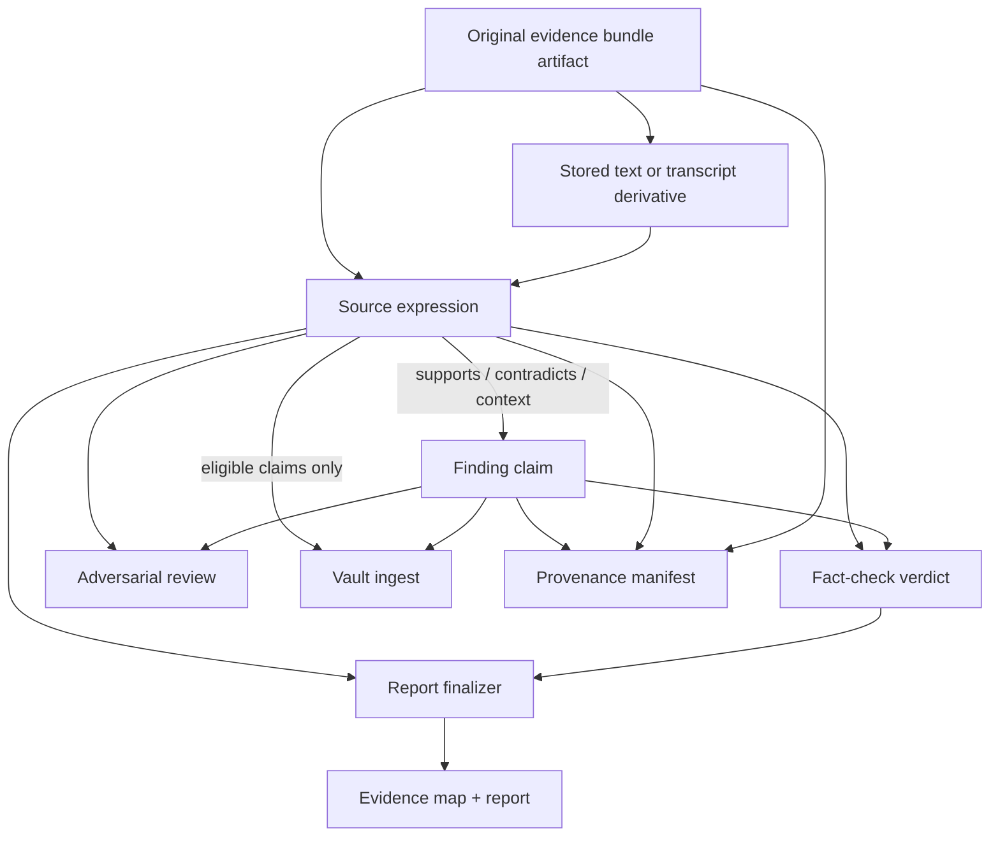
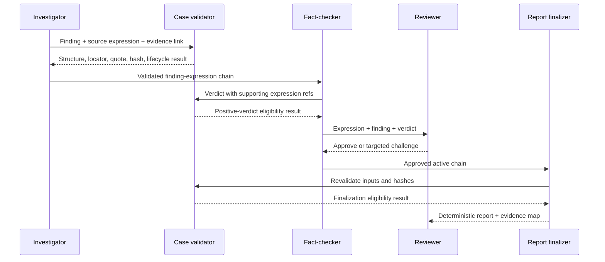
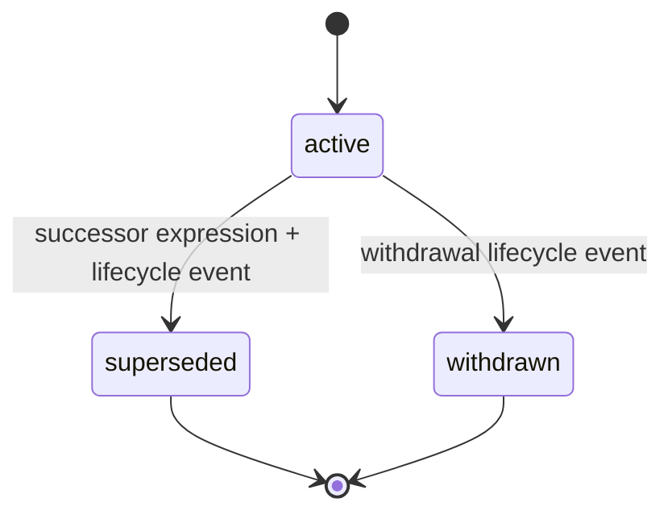

# feat: Add source-expression audit chain

## Summary

Add a first-class, case-local source-expression contract that preserves exact source passages and links them many-to-many with Spotlight findings. Use it to make the source passage → normalized finding → fact-check verdict → report statement chain inspectable, adversarially reviewable, and deterministically traceable without replacing the finding as Spotlight's canonical verdict unit.

The rollout is additive and version-gated. Legacy cases remain readable. A new case contract activates strict source-expression requirements for positive verdicts and report finalization only after a pilot demonstrates acceptable data quality and reviewer value.

---

## Problem Frame

Spotlight preserves acquired source artifacts in `data/evidence-bundle.json` and normalized investigative propositions in `data/findings.json`. Exact quotes and line/JSON locators may appear inside `data/fact-check.json`, but they are verdict-local: they have no stable identity, cannot be shared cleanly across findings, are not a first-class review surface, and do not survive durable claim ingest as structured provenance.

This leaves three gaps:

1. A stored finding does not always retain an addressable exact passage showing what the source actually said.
2. Adversarial review cannot consistently inspect whether normalization omitted context, changed attribution, mistranscribed a quote, or strengthened the source.
3. Report finalization can verify finding IDs, verdicts, hashes, and coverage, but cannot require a complete passage-level audit chain or render direct quotations from canonical source text.

NewsAtom demonstrates the value of preserving original expressions, but its sentence atom is the wrong verdict boundary for Spotlight. Sentences and truth-evaluable propositions are many-to-many. The source expression must therefore be additive to findings, not a replacement.

---

## Product Goals

- Preserve exact source wording with stable case-local identity, locator, artifact hash, attribution, language, and lifecycle.
- Link one expression to multiple findings and one finding to multiple expressions with an explicit relation.
- Give reviewers a side-by-side source expression → finding → verdict view and expression-targeted feedback.
- Make report quotations renderer-owned and expression-derived rather than model-retyped.
- Deterministically block stale, tampered, dangling, withdrawn, or superseded expression references.
- Carry validated expressions into eligible durable claim records without creating a second claim system.
- Keep old cases usable and make strict activation explicit and non-bypassable.

## Non-Goals

- Replacing proposition-level findings with sentence atoms.
- Automatic passage extraction, sentence segmentation, claim decomposition, or semantic entailment scoring.
- Deterministically proving that a passage supports a finding or that model-authored framing is not overstated.
- Adopting NewsAtom's semantic frames, subject/predicate/object arrays, event/topic taxonomy, or closed epistemic taxonomy.
- Creating a standalone vault-wide expression registry in V1.
- Treating rights metadata as evidence of legal permission or reuse entitlement.
- Fabricating expressions during migration when exact text, locator, or source artifact is unavailable.

---

## Actors and Key Flows

- A1. **Investigator:** creates expressions from acquired source artifacts and links them to candidate findings.
- A2. **Fact-checker:** independently validates expressions, adds expressions from corroborating or contradicting sources, and references them in evidence trails.
- A3. **Reviewer:** compares exact wording with normalized findings and challenges context, attribution, transcription, locator, relation, or lifecycle.
- A4. **Report finalizer:** enforces active expression coverage, renders structured quotations, and records the passage-level evidence map.
- A5. **Vault ingest:** copies expressions only into claim records that already pass Spotlight's eligibility gate.

---

## Requirements

### Source-expression contract

- R1. Activated cases have `data/source-expressions.json`, validated by a dedicated JSON Schema and Spotlight's stdlib case validator.
- R2. Every expression has a unique stable ID, exact non-empty original text, a case-contained anchor locator, an anchor-artifact SHA-256, an expression fingerprint, and a resolvable original evidence-bundle reference.
- R3. Every expression carries one or more structured finding links with relation `supports`, `contradicts`, or `context`; the expression-side links are authoritative.
- R4. The contract supports many-to-many relationships without duplicating authoritative link state in `findings.json`.
- R5. Optional expression metadata includes BCP 47 language, printed attribution, direct-quote status, creator role/cycle, and derivative lineage.
- R6. Text derived from PDF, OCR, audio, video, or imagery must identify and hash the stored text/OCR/transcript anchor separately from the original evidence-bundle artifact. Quote matching verifies the derivative bytes; provenance preserves both hashes. A translation is a labeled derivative, never the canonical original quote.

### Validation and epistemic boundaries

- R7. Validation checks unique IDs, finding/evidence resolution, path containment, locator shape, exact text within the selected range or JSON Pointer, artifact hash, link relation, lifecycle targets, and acyclic supersession.
- R8. A positive verdict in an activated case requires at least one active supporting expression referenced by its fact-check evidence trail; contradiction expressions may appear in evidence against.
- R9. A validation failure names the expression ID and exact path, locator, hash, lifecycle, or reference defect so the agent can repair the anchor or downgrade the verdict.
- R10. Documentation and generated artifacts state that structural checks prove traceability and integrity, not semantic entailment.
- R11. RLM output, search snippets, inaccessible sources, pending-human-verification captures, and unresolvable artifacts cannot anchor a positive-verdict expression.

### Adversarial review

- R12. Review displays exact expression text, source and locator, attribution/language, relation, hash status, lifecycle, normalized finding, grounding, and fact-check verdict together.
- R13. Feedback may target a source-expression ID and classify omitted context, attribution error, wrong relation, mistranscription, bad locator, stale source, or other challenge.
- R14. Expression identity payload is immutable after verdict use. Changing text, locator, anchor hash, evidence lineage, finding link, or relation requires a new expression ID. Appending a supersession or withdrawal lifecycle event marks affected findings for validation and independent re-fact-check before review or report regeneration.

### Report guardrails and provenance

- R15. Reportable positive findings in activated cases resolve to active source expressions before finalization.
- R16. A structured report quotation contains an expression ID, not model-authored quote text; deterministic rendering pulls and escapes the canonical expression text and attribution.
- R17. `evidence-map.json` records expression IDs, relations, locators, hashes, and lifecycle, and the report input ledger hashes `data/source-expressions.json`.
- R18. A missing, dangling, tampered, superseded, or withdrawn expression blocks finalization without overwriting previously valid report artifacts.
- R19. Provenance manifests hash the expression artifact and carry expression references on claims. Manifests use immutable revision paths with parent/input-set hashes and a derived current pointer. Any expression/finding/fact-check mutation marks the pointer stale and requires a new revision; prior signed bytes and signing receipts remain immutable history.

### Lifecycle, compatibility, and durable storage

- R20. Expression identity payload is immutable. Corrections create a new ID and append lifecycle events with actor, timestamp, reason, and successor. Legal transitions are `active → superseded` or `active → withdrawn`; terminal expressions cannot reactivate, and supersession/derivative graphs are acyclic.
- R21. Strict activation requires both `findings.json` contract version `1.1` and an append-only case-contract migration receipt containing prior input hashes, activated version, timestamp, and tool version. File presence alone never determines activation, and supported Spotlight workflows reject downgrade or partial activation.
- R22. New-case creation emits the activation receipt only after the activation release. Merely opening a legacy case does not migrate it; supported workflows refuse legacy finding/verdict mutation or new report generation until explicit migration. Arbitrary manual filesystem edits are outside this guarantee.
- R23. Case migration uses a dedicated dry-run-first, idempotent utility and `data/source-expression-migration.json` receipt. Apply refuses stale inputs, writes the new artifact and references atomically, validates them, then records activation last. Every skip has a machine-readable reason; deterministic IDs are stable across input ordering.
- R24. Vault ingest copies active expression snapshots only for findings that pass the existing claim eligibility gate. Snapshots use `(project, expression ID, expression fingerprint)` identity and remain embedded evidence within claim records, not independent durable claims.
- R25. Re-ingest appends deterministic lifecycle/ingest events, never removes inactive historical expressions, validates under the existing vault lock, and records expression input hash plus written/skipped IDs in its receipt.

### Distribution and operating modes

- R26. Sensitive mode uses the same local validation contract and existing no-cross-link vault behavior; source expressions do not create a new confidentiality guarantee.
- R27. Canonical root schemas, scripts, skills, agents, docs, and tests are regenerated into the Spotlight plugin payload with parity checks; generated plugin files are never hand-edited.

---

## Key Technical Decisions

- KTD1. **Findings remain the verdict unit.** Existing fact-check, report, provenance, and vault consumers join on finding IDs and claim text. Expressions preserve source wording but do not receive truth verdicts.
- KTD2. **Prototype a separate case artifact, then gate contract lock on the pilot.** `data/source-expressions.json` gives expressions stable identity, lifecycle, and shared many-to-many use without nesting a third copy inside findings or verdicts. It adds cross-file atomicity cost, so activation requires evidence that it outperforms embedded expressions and richer evidence records on reviewer value, duplicate rate, and migration complexity.
- KTD3. **Reuse one locator grammar.** Generalize the existing `source_ref` line-range/JSON-Pointer contract and its path/hash/quote validation rather than inventing an incompatible selector format.
- KTD4. **Expression-side links own passage polarity.** Expression → finding owns `supports`/`contradicts`/`context`; evidence-bundle → finding continues to own acquisition/grounding linkage; fact-check → expression records verdict use and the expression/finding fingerprints used. Validators reject conflicts rather than selecting a winner.
- KTD5. **Contract activation is monotonic through supported workflows.** Findings version `1.1` plus an append-only migration receipt activates strict behavior. Producers, mutators, finalizers, and ingest reject omissions, downgrade, and partial activation; old binaries refuse activated cases they cannot validate.
- KTD6. **Direct quotations are renderer-owned.** Models may select an expression ID but never supply the published quote string. Free-form report prose remains subject to fact-check and human editorial review.
- KTD7. **Immutable core, append-only lifecycle.** Text, locator, anchor hash, evidence lineage, and finding relation define the fingerprint and never mutate after verdict use. Lifecycle events and successor records derive current status and invalidate only verdicts bound to the changed fingerprint.
- KTD8. **Non-text evidence uses a separately identified text derivative.** V1 anchors quote matching in a stored OCR/transcript/caption derivative with its own path and hash, while a distinct evidence-bundle reference preserves the original artifact and human-verification status.
- KTD9. **No independent vault expression corpus.** Durable expressions travel with eligible claim records, preserving the existing distinction between case-local evidence and cross-case verified intelligence.

---

## Source-Expression V1 Contract

The exact JSON syntax is implementation-owned, but the contract has these normative fields:

| Field | Required | Purpose |
|---|---|---|
| `id` | Yes | Stable case-local identity such as `SX1` |
| `text` | Yes | Exact original-language passage |
| `anchor_ref` | Yes | Case-contained text-derivative path plus line range or JSON Pointer |
| `anchor_sha256` | Yes | Integrity of the exact bytes used for quote matching |
| `original_evidence_bundle_id` | Yes | Link to acquisition provenance and original artifact/hash |
| `expression_fingerprint` | Yes | Deterministic identity of immutable payload plus finding relation |
| `finding_links` | Yes | Finding ID plus `supports`, `contradicts`, or `context` relation |
| `lifecycle_events` | Yes | Append-only activation, supersession, or withdrawal history |
| `created_by` / `cycle` | Yes | Investigator/fact-checker ownership and investigation cycle |
| `language` | No | BCP 47 original-language tag |
| `attribution` / `direct_quote` | No | Printed attribution and quote boundary metadata |
| `supersedes` / successor / reason | Conditional | Append-only correction or withdrawal lineage |
| `derived_from_expression_id` / `derivative_type` | Conditional | Translation or normalized text derivative lineage |

Rights/origin fields are deferred until Spotlight has a deduplicated source/work contract and legal review. They must not be copied onto every expression merely because NewsAtom does so.

### Link ownership invariants

| Edge | Owns | Must agree with |
|---|---|---|
| Expression → finding | Passage polarity and expression fingerprint | Existing finding ID and canonical claim fingerprint |
| Evidence bundle → finding | Acquisition provenance and grounding support type | Expression's evidence-bundle reference and linked finding |
| Fact-check → expression | Which immutable expression fingerprint was used for a verdict | Active lifecycle state, finding link, and fact-check claim text |

### Storage alternatives and activation gate

| Alternative | Strength | Cost | Pilot rejection signal |
|---|---|---|---|
| Separate `source-expressions.json` | Independent identity/lifecycle; shared many-to-many indexing | Cross-file atomicity and activation complexity | High orphan/partial-write rate or materially harder migration |
| Embedded collection in `findings.json` | Single transaction and simpler activation | Couples expression lifecycle to findings rewrites | Repeated duplication or inability to share/update expressions cleanly |
| Richer evidence/fact-check records | Smallest surface change | Keeps exact passages verdict-local or acquisition-local | Review cannot show stable reusable expression identity |

Stage 1 implements the separate artifact as the candidate, but Stage 2 activation is blocked until pilot evidence justifies it against the other two alternatives.

---

## High-Level Technical Design

### Contract topology

### Positive-verdict and report sequence

### Expression lifecycle

Lifecycle state is derived from append-only events. Any transition away from `active` invalidates dependent positive verdicts bound to that expression fingerprint, reports, and current provenance until affected findings are re-fact-checked and artifacts regenerated.

---

## Acceptance Examples

| ID | Scenario | Expected outcome |
|---|---|---|
| AE1 | One sentence contains two propositions and `SX1` links to `F1` and `F2`. | Both links validate independently; findings retain separate verdicts. |
| AE2 | One finding requires two passages, `SX1` and `SX2`. | Both appear in review and the report evidence map. |
| AE3 | Expression text differs by one word from its selected lines. | Validation fails before a positive verdict. |
| AE4 | Locator escapes the case directory or its artifact hash is stale. | Validation fails and identifies the expression ID and defect. |
| AE5 | `SX2` supersedes `SX1`. | The old report becomes stale; affected findings require re-fact-check before regeneration. |
| AE6 | Review challenges `SX1` attribution. | Feedback targets `SX1`, marks linked findings affected, and triggers validation plus re-fact-check. |
| AE7 | A report includes a direct quotation. | Draft supplies only the expression ID; renderer emits the exact escaped expression text. |
| AE8 | A disputed or ineligible finding has valid expressions. | Expressions remain case-local and no durable claim expression is ingested. |
| AE9 | A legacy `1.0` case has no expression artifact. | Existing validation remains available; strict expression protection is not claimed. |
| AE10 | A `1.1` case omits expressions for a positive verdict. | Verdict/report finalization fails; omission cannot masquerade as legacy behavior. |
| AE11 | Backfill finds a quote without a resolvable locator. | It skips the record with a reason and never fabricates an expression. |
| AE12 | Backfill or ingest runs twice. | No duplicate expressions, claim records, or history entries are created. |
| AE13 | An audio finding has a validated transcript derivative. | Expression anchors to transcript lines and remains linked to the original audio evidence item. |
| AE14 | A translation is used in review. | Original expression remains canonical; translation is visibly labeled as a derivative. |

---

## Rollout and Success Metrics

### Stage 1: Pilot-capable release, legacy emission by default

Implement the expression artifact and validators in non-enforcing mode, then annotate 10–20 representative existing cases covering multi-claim sentences, multi-passage claims, PDFs/OCR, transcripts, multilingual sources, contradictions, and corrections.

Success metrics:

- At least 95% of pilot expressions resolve and revalidate without manual locator repair after creation.
- Zero fabricated locators or passages in migration output.
- Reviewers can identify the exact source wording for every pilot finding without opening an unindexed document search.
- No drift between expression text, selected source range, and report-rendered quotations.
- Duplicate-expression rate stays below 10%, unresolved expression/finding links stay below 5%, and any higher result blocks activation pending redesign.
- Existing `1.0` cases and reports continue to validate unchanged.

### Stage 2: Recorded acceptance and activation release

After the product owner approves a checked-in pilot-results artifact against the thresholds above, a separate activation change makes new cases emit findings contract `1.1` plus the activation receipt. Strict expression requirements then apply to positive verdicts, review approval, report finalization, and provenance.

Rollback may stop creating new `1.1` cases, but activated cases remain strict and readable. Older binaries that cannot validate `1.1` must refuse them rather than interpret them as legacy.

### Stage 3: Conservative migration

Offer dry-run backfill for legacy cases with exact existing fact-check anchors. Migration is opt-in per case; ambiguous cases remain `1.0` and are reported as expression-unprotected.

---

## Implementation Units

### U1. Source-expression schema and activation receipt contract

- **Goal:** Define the new artifact, shared locator grammar, lifecycle, finding links, and explicit case activation.
- **Requirements:** R1–R6, R20–R22
- **Dependencies:** none
- **Files:** `schemas/source-expressions.schema.json` (new), `schemas/case-contract.schema.json` (new), `schemas/findings.schema.json`, `schemas/fact-check.schema.json`, `schemas/evidence-bundle.schema.json`, `tests/fixtures/source-expressions.sample.json` (new), `tests/validate-case-check.py`
- **Approach:** Add the expression and activation-receipt contracts; allow findings versions `1.0` and `1.1` with exact schema dispatch rather than a permissive union. Centralize or exactly mirror the existing locator definition. Distinguish anchor derivative/hash from original evidence identity/hash and formalize link ownership invariants.
- **Patterns to follow:** `schemas/evidence-bundle.schema.json` structured claim links; `schemas/fact-check.schema.json` source references; versioned case contracts in current schemas.
- **Test scenarios:** Valid many-to-many expressions; duplicate ID; dangling finding/evidence ID; invalid relation; invalid line/JSON selector union; missing/partial activation receipt; omitted version; downgrade after activation; valid legacy `1.0` case; lifecycle/derivative graph cycles; separate derivative/original hashes.
- **Verification:** Schema fixtures cover every normative field and both legacy and activated contract modes without changing existing `1.0` fixture meaning.

### U2. Deterministic expression and positive-verdict validation

- **Goal:** Enforce expression integrity, lifecycle, cross-file references, and activated-case positive-verdict eligibility.
- **Requirements:** R7–R11, R20–R22
- **Dependencies:** U1
- **Files:** `scripts/validate-case.py`, `scripts/validate-fact-check.py`, `tests/validate-case-check.py`, `tests/validate-fact-check-check.py` (new or existing equivalent), `tests/smoke.sh`
- **Approach:** Extract the existing case-contained path, line/JSON Pointer, exact quote, and hash checks into a shared stdlib validation seam used by expressions and fact-check evidence. Build a finding-indexed expression view, validate lifecycle/derivative acyclicity, bind verdict use to expression and finding fingerprints, and require active support only in activated cases.
- **Execution note:** Start with characterization coverage for the current fact-check anchor behavior before extracting shared validation.
- **Test scenarios:** One-word quote mismatch; stale anchor/original hash; traversal; empty/invalid range; invalid JSON Pointer; illegal reactivation or branching; same-ID core/link edit; stale expression/finding fingerprint; positive verdict without active support; contradiction-only evidence; RLM or pending-human-verification anchor; legacy behavior unchanged.
- **Verification:** Every acceptance failure reports the responsible expression ID and no existing positive-verdict validation weakens.

### U3. Producer and fact-checker contracts plus pilot fixtures

- **Goal:** Make investigator and fact-checker produce consistent expressions and exercise the contract on representative cases before strict activation.
- **Requirements:** R2–R11, R20, R23
- **Dependencies:** U1, U2
- **Files:** `agents/investigator.md`, `agents/fact-checker.md`, `skills/epistemic-grounding/SKILL.md`, `skills/investigate/references/coverage-discipline.md`, `tests/fixtures/` pilot cases, `docs/investigating.md`, `docs/fact-checking.md`
- **Approach:** Assign expression creation to whichever agent acquires the source, recording role and cycle. Require original-language text, explicit relation, and text derivatives for non-text evidence. Build pilot fixtures from recoverable exact anchors; do not add automatic extraction.
- **Test scenarios:** Investigator-created support; fact-checker-added contradiction; shared expression across findings; multiple expressions per finding; transcript derivative; translation derivative; unavailable source rejected; pilot dry run records duplicates and unresolved links.
- **Verification:** Pilot cases pass validators and yield a reviewable expression chain without fabricated anchors.

### U4. Adversarial review and targeted feedback

- **Goal:** Expose expression-to-finding normalization and let reviewers challenge the expression layer directly.
- **Requirements:** R12–R14
- **Dependencies:** U1–U3
- **Files:** `skills/review/SKILL.md`, `skills/review/references/template.html`, `skills/review/references/feedback-schema.md`, `tests/review-template-check.js`
- **Approach:** Join active and historical expressions by finding ID, render the side-by-side chain, and add optional expression-targeted feedback categories. Feedback processing records changed/superseded expression IDs and affected findings, then routes them through validation and re-fact-check before regenerating review.
- **Test scenarios:** Multi-expression display; support vs contradiction styling; attribution/context challenge; superseded expression history; malicious text remains inert; dangling feedback target skipped with warning; affected findings re-enter fact-check; annotation review never changes verdict directly.
- **Verification:** A reviewer can trace and challenge every activated-case finding at expression granularity without losing existing finding-level feedback.

### U5. Report drafting, deterministic quotes, and finalization

- **Goal:** Add expression coverage to the deterministic report gate and make published quotations canonical.
- **Requirements:** R15–R18
- **Dependencies:** U1, U2
- **Files:** `schemas/report-draft.schema.json`, `scripts/validate-report-draft.py`, `scripts/render-report.py`, `scripts/finalize-report.py`, `scripts/validate-report.py`, `skills/report-drafting/SKILL.md`, `skills/report-drafting/references/citation-discipline.md`, `tests/render-report-check.py`, `tests/validate-report-check.py`
- **Approach:** Add structured quote selections by expression ID, index active expressions per reportable finding, hash the expression artifact as an input, and extend `evidence-map.json`. Preserve free-form editorial prose but do not claim deterministic semantic-overstatement detection.
- **Test scenarios:** Exact quote rendering; escaping; missing/dangling/superseded expression blocks; positive finding coverage; stale input hash; evidence-map parity; deterministic rerender byte equality; failed gate leaves previous reports untouched; legacy report behavior explicit.
- **Verification:** Every activated-case quote and reportable finding has a resolvable passage chain, while the renderer never accepts model-authored quote text.

### U6. Provenance and mutation invalidation

- **Goal:** Carry expression integrity into case provenance and prevent stale signed/review/report artifacts after mutation.
- **Requirements:** R17–R20
- **Dependencies:** U1, U2, U5
- **Files:** `schemas/provenance-manifest.schema.json`, `scripts/build-provenance-manifest.py`, `skills/provenance-signing/SKILL.md`, `tests/provenance-manifest-check.py`
- **Approach:** Hash the expression artifact, attach expression and original-artifact hashes to claim entries, and store immutable manifest revisions with parent/input-set hashes plus a derived current pointer. Mutation marks current stale; signing failure or retry never overwrites or duplicates prior history.
- **Test scenarios:** Repeated unsigned build idempotence; expression and original hashes present; stale-current detection; parent linkage; supersession revision; signed bytes/receipt preserved; signing failure and retry; review feedback mutation requires rebuild.
- **Verification:** Provenance can reconstruct which exact active expressions supported each manifested claim at that revision.

### U7. Deterministic case migration and activation

- **Goal:** Migrate recoverable legacy case anchors atomically and record monotonic activation.
- **Requirements:** R21–R23
- **Dependencies:** U1–U3
- **Files:** `scripts/migrate-source-expressions.py` (new), `schemas/source-expression-migration.schema.json` (new), `tests/migrate-source-expressions-check.py` (new), `tests/fixtures/` migration cases
- **Approach:** Dry-run records input hashes, deterministic anchor-to-expression ID mapping, skips, tool/contract version, and proposed output hashes. Apply refuses stale inputs, writes expressions and fact-check references as one validated bundle, then records activation last. Interrupted or partial output is detected and never interpreted as activated.
- **Test scenarios:** Exact recoverable migration; ambiguous locator skipped; stale dry run refused; interrupted/partial apply; deterministic IDs independent of ordering; repeated apply no diff; downgrade after activation refused.
- **Verification:** Every activated migrated case has a validated receipt and no invented or partially published expression chain.

### U9. Durable claim ingest

- **Goal:** Preserve validated expression snapshots and lifecycle events with eligible claim records.
- **Requirements:** R24–R26
- **Dependencies:** U2, U6, U7
- **Files:** `skills/ingest/SKILL.md`, `skills/ingest/references/entity-model.md`, `skills/ingest/references/registry-spec.md`, `tests/vault-claims-check.py`, `tests/fixtures/claims-vault/`
- **Approach:** Add Source Expressions snapshots keyed by project, expression ID, and fingerprint to eligible claim notes. Append deterministic lifecycle/ingest events under the vault lock; preserve inactive history; log written/skipped IDs and the source-expression input hash. Keep expressions out of independent registries and excluded findings.
- **Test scenarios:** Verified and partially verified eligibility; disputed/ineligible finding excluded; expression-less legacy claim preserved; supersession after ingest; downgrade attempt; partial failure and lock cleanup; re-ingest byte-identical; sensitive-vault no-cross-link parity.
- **Verification:** Vault validation proves every snapshot belongs to an eligible claim and repeated ingest adds no duplicate snapshots or events.

### U8. Pipeline documentation, plugin parity, and pilot release

- **Goal:** Make the contract visible across orchestration, case recovery, distribution, and operator documentation while legacy emission remains the default.
- **Requirements:** R21–R27
- **Dependencies:** U1–U7, U9
- **Files:** `AGENTS.md`, `README.md`, `docs/structure.md`, `docs/investigating.md`, `docs/fact-checking.md`, `docs/sensitivity.md`, `skills/spotlight/SKILL.md`, `scripts/build-plugin-payload.py`, `plugins/spotlight/` (generated), `tests/plugin-distribution-check.py`, `tests/smoke.sh`
- **Approach:** Document legacy vs activated cases, migration triggers, deterministic limits, recovery rules, and pilot acceptance. Regenerate the plugin payload from canonical roots with new-case emission still at `1.0` by default. Produce a checked-in pilot-results artifact and recommendation.
- **Test scenarios:** Plugin parity; schema/script/skill presence; legacy recovery; opt-in pilot case; sensitive-mode docs match behavior; default new-case activation remains disabled.
- **Verification:** A clean plugin install can run pilot cases with the same opt-in contract as the root repository without changing default legacy emission.

### U10. Activation release and mixed-version rollback

- **Goal:** Enable strict new-case emission only after recorded pilot approval while preserving activated-case guarantees during rollback.
- **Requirements:** R21–R27
- **Dependencies:** U1–U9 and product-owner approval of pilot thresholds
- **Files:** `skills/spotlight/SKILL.md`, `agents/investigator.md`, `agents/fact-checker.md`, `scripts/validate-case.py`, `scripts/finalize-report.py`, `skills/ingest/SKILL.md`, `tests/install-spotlight-smoke.sh`, `tests/plugin-distribution-check.py`, `tests/smoke.sh`
- **Approach:** Change supported writers to emit `1.1` plus activation receipts, keep all readers version-dispatched, and make older/incompatible binaries refuse activated cases. Rollback may disable future activation only; it never relaxes validation for existing `1.1` cases.
- **Test scenarios:** Mixed `1.0`/`1.1` install; forward-incompatible reader refusal; activation omission/downgrade refusal; rollback stops new activation while existing cases remain strict; partial deployment cannot emit invalid `1.1` cases.
- **Verification:** The activation release cannot create an activated case unless every bundled writer, reader, validator, finalizer, review, provenance, and ingest consumer supports the contract.

---

## System-Wide Impact

- **Data lifecycle:** introduces immutable passage identities and a second supersession chain alongside claim history. Validators must keep their responsibilities distinct.
- **Agent behavior:** investigator and fact-checker gain a structured output responsibility; their independence remains intact because either may add expressions from separately acquired evidence.
- **Review:** becomes the primary human checkpoint for source-to-claim transformation, not merely claim/verdict presentation.
- **Reports:** gain deterministic passage traceability and exact quote rendering but retain human responsibility for semantic framing.
- **Vault:** claim records become more auditable without admitting unverified expressions as cross-case knowledge.
- **Compatibility:** existing `1.0` artifacts remain valid; strict protection is accurately claimed only for activated `1.1` cases.
- **Security/privacy:** no new external service or dependency; existing case containment and sensitive-mode boundaries apply.

---

## Risks and Mitigations

- **Three drifting copies of a quote:** use one canonical expression object; fact-check, review, report, and ingest reference its ID.
- **Guardrail overclaim:** state in schemas/docs/UI that traceability is deterministic but entailment is not; preserve independent fact-check and editorial review.
- **New-case bypass:** require findings `1.1` plus an append-only activation receipt; supported workflows reject omission, downgrade, and partial bundles.
- **Selector limitations for non-text evidence:** require a stored text derivative linked to the original artifact and surface human-verification status.
- **Supersession complexity:** immutable IDs, acyclic lineage validation, and automatic staleness of dependent verdict/report/provenance state.
- **Migration false confidence:** dry-run, exact-anchor-only backfill with visible skips; legacy cases remain explicitly expression-unprotected.
- **Rollback contract weakening:** rollback stops new activation only; existing activated cases remain strict and incompatible binaries refuse them.
- **Review template drift:** strengthen payload/template integration tests within the existing instruction-driven review architecture.
- **Rights confusion:** defer rights placement and require legal review before adding any field that could be mistaken for permission.

---

## Scope Boundaries

### Deferred to Follow-Up Work

- Native audio timestamp, video frame, image-region, and PDF-page locator types after text-derivative V1 usage is measured.
- Cross-case expression search or a standalone vault expression registry.
- Source/work deduplication and rights/origin inheritance.
- Automated passage extraction, claim decomposition, or entailment assistance.

### Outside This Product's Identity

- Automatic truth determination, contradiction erasure, or confidence upgrades based solely on expression presence.
- Silent rewriting of source wording, claim history, verdicts, or signed provenance.
- Treating metadata as a legal authorization mechanism.

---

## Sources and Research

- `cases/newsatom-information-units/summary.md` — verified architecture conclusion and pilot limitation.
- `cases/newsatom-information-units/research/newsatom-spotlight-crosswalk.md` — NewsAtom field mapping and source-expression alternatives.
- `cases/newsatom-information-units/data/fact-check.json` — independent verification and confidence boundaries.
- `skills/ingest/references/registry-spec.md` — canonical claim identity, registry parity, and verdict constraints.
- `schemas/fact-check.schema.json` and `scripts/validate-fact-check.py` — existing exact quote, locator, hash, containment, and evidence-link checks.
- `schemas/evidence-bundle.schema.json` — acquisition provenance and structured finding-link pattern.
- `skills/review/SKILL.md` and `skills/review/references/feedback-schema.md` — adversarial review join and feedback flow.
- `skills/report-drafting/SKILL.md`, `scripts/finalize-report.py`, and `scripts/validate-report.py` — model/deterministic boundary and no-overwrite finalization gate.
- `skills/ingest/SKILL.md` and `skills/ingest/references/entity-model.md` — durable claim eligibility and append-only ingest semantics.
- `scripts/build-plugin-payload.py` and `tests/plugin-distribution-check.py` — canonical-root and generated-plugin parity rules.
