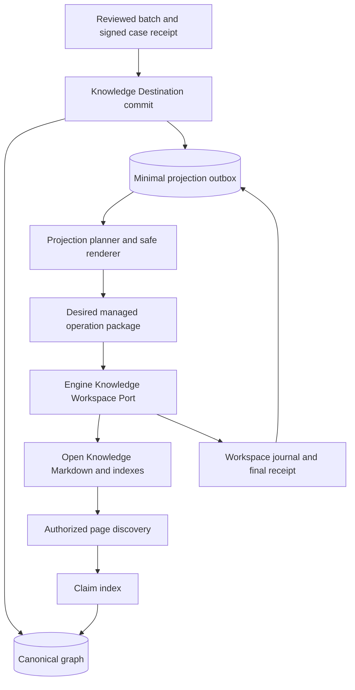

# Spotlight Open Knowledge projection implementation

> Superseded on 2026-08-18 after the runtime boundary was simplified. The
> implemented architecture keeps projection transactions and Open Knowledge
> retrieval inside Spotlight; Engine is limited to installation, updates,
> configuration, and read-only doctor checks. The final requirements and
> architecture are in
> [`../brainstorms/2026-08-18-open-knowledge-projection-requirements.md`](../brainstorms/2026-08-18-open-knowledge-projection-requirements.md)
> and [`../knowledge-destination.md`](../knowledge-destination.md).

## Summary

Implement the reviewed claim–event–story projection by extending Spotlight's
existing graph transaction and Engine's existing journaled Knowledge Workspace
Port. Open Knowledge remains the only Markdown index and embedding owner;
Spotlight adds no second search system or event pages. New claim pages stop only
after the graph-lookup migration gate passes.

---

## Problem Frame

Spotlight can already validate, approve, store, and traverse a versioned
claim–event–story graph through the local SQLite conformance adapter. That graph
is not visible in journalists' Open Knowledge workspace, while the current
one-claim-per-file ingest pattern is too noisy to extend to canonical events and
stories. Open Knowledge can discover investigation-sized pages, including a
100-claim dossier, but its installed search surface is page-level and cannot be
the authority for exact identity, membership, approval, or reverse traversal.

The missing bridge is a recoverable projection: graph commits must durably
record projection intent, a deterministic planner must derive approved readable
content from exact graph and signed-case versions, and Engine must apply only
owned Markdown regions through its existing workspace journal. Search then
discovers investigation and story pages; exact questions return to the graph.

This is a cross-repository plan. Paths labeled **Spotlight** are relative to the
`spotlight` repository root. Paths labeled **Engine** are relative to the
`engine` repository root.

---

## Requirements

### Authority, compatibility, and projection shape

- R1. A reviewed graph commit remains the only authority for canonical claims,
  events, story arcs, and membership. Candidate and rejected records never
  enter the normal projection, and Markdown cannot change graph state. (Origin
  R1–R3.)
- R2. Each projection manifest binds exact graph record versions, the graph
  commit receipt, a verified signed-case provenance revision, a signed
  case-policy receipt, and hashes for every case artifact used to render
  approved text. (Origin R4.)
- R3. Projection never changes signed or activated case artifacts, legacy claim
  notes, or investigation content outside its managed continuity block. Legacy
  findings and source-expression variants remain byte-compatible. (Origin R5.)
- R4. After the R18 activation gate passes, a graph-enabled case updates its
  existing investigation page and creates one owned page per approved story
  arc. It creates no new claim files, event files, or duplicate investigation
  dossier. Before activation, existing claim-note ingest remains unchanged.
  (Origin R6, R8–R10, R12.)
- R5. Investigation continuity contains a claim table of contents, stable
  claim-ID-derived anchors, approved propositions, versions, provenance
  pointers, event/story links, and non-content tombstones for moved or
  superseded anchors. Events remain embedded in investigation and story views.
  (Origin R7–R9.)
- R6. Identical graph versions and case hashes render byte-identical managed
  content; changed input touches only affected managed blocks, owned story
  pages, and their manifest. (Origin R11.)

### Search and exact retrieval

- R7. Broad discovery uses Open Knowledge semantic or full-text search through
  an authorized `query-vault` facade. It returns page-level investigation or
  story results plus a claim index and never implies that page ranking proves a
  claim identity. (Origin R13–R14.)
- R8. Exact IDs, status, coverage, provenance, membership, prior-verdict lookup,
  deduplication, and forward/reverse traversal use the structured graph. Exact
  lookup never selects the highest-ranked semantic page as identity evidence.
  (Origin R12, R14.)
- R9. Spotlight neither reads Open Knowledge vectors nor configures, calls, or
  maintains another embedding model, vector table, scheduler, or search UI.
  Open Knowledge owns the configured provider. (Origin R15.)
- R10. Setup, doctor, and search responses report the actual semantic/full-text
  capability and active provider policy. Disallowed or unavailable semantic
  search falls back to clearly labeled full text without starting another
  service. (Origin R16–R17.)
- R11. Search results carry enough projection receipt metadata to compare with
  current graph state. Withdrawal, erasure, lost scope, destination mismatch,
  and stricter classification cause immediate omission even while de-indexing is
  pending; only non-security freshness drift may be labeled. Legacy claim notes
  are labeled and ranked behind managed investigation/story pages. Retrieved
  Markdown enters agent context in a typed untrusted-data envelope and cannot
  authorize tools or policy changes. (Origin R12, R21, R24.)

### Delivery, authorization, and minimization

- R12. The destination transaction creates an idempotent minimal projection job
  atomically with each supported graph commit. Graph state remains committed
  while failed work stays visibly retryable. Issuing, revising, or revoking a
  signed case-policy receipt is also a destination transaction that advances
  the affected case/destination projection generation and atomically enqueues
  reconciliation or removal, even when graph records did not change. (Origin
  R18–R19, R23, R25.)
- R13. Engine stages managed-block upserts and managed-page removals in one
  journaled package with per-operation expected versions, ownership/namespace
  validation, idempotent retry, reconciliation, and a durable final receipt. No
  immediate edit or raw filesystem/MCP deletion bypass is accepted. (Origin
  R20.)
- R14. Every graph handoff, write, and removal is authorized against an
  authenticated actor, case, classification, and destination project. Search
  carries an authenticated actor, destination project, and allowed
  classification ceiling; policy authorizes each returned case before content
  reaches the caller. Effective identity and scopes come from a verified issuer,
  never caller-controlled request fields. (Origin R23, R27.)
- R15. The renderer allowlists approved propositions, summaries, citations,
  links, and graph metadata; it excludes private archives, withheld evidence,
  secrets, disallowed personal data, and internal reasoning. It escapes raw
  HTML, validates IDs/paths/links, and rejects executable URL schemes. (Origin
  R24, R26–R27.)
- R16. Managed removal completes only after the workspace port confirms the
  document, full-text entry, embedding, and provider-derived copy are absent.
  If the backend cannot prove this, the job remains incomplete and production
  readiness fails closed. (Origin R25.)
- R17. The local SQLite adapter remains a development and conformance
  implementation. Production promotion requires an externally controlled
  Knowledge Destination passing the same transaction, authorization, signature,
  traversal, outbox, and conformance contracts. (Origin R22.)

### Migration, distribution, and verification

- R18. New standalone claim-note creation remains enabled until typed graph
  replacements for investigator lookup, fact-checker lookup, deduplication, and
  prior verdicts pass a recorded activation gate. Existing notes remain readable
  and unchanged after activation. (Origin R12.)
- R19. Canonical Spotlight sources, generated plugin payload, runtime prompts,
  schemas, documentation, and setup behavior agree. Plugin mirrors are produced
  through the existing payload builder rather than edited independently.
- R20. Automated evidence covers every origin acceptance example, including a
  100-claim case, exact forward/reverse traversal, interruption convergence,
  concurrent edit conflict, managed isolation, stale results, authorization,
  migration, semantic/full-text discovery, and de-index confirmation.

---

## Assumptions

- The installed Engine remains the supported process boundary between
  Spotlight and Open Knowledge. A small `bsig knowledge` command surface may
  expose the existing Go port to Spotlight scripts and runtimes; Spotlight will
  not call raw Open Knowledge mutation tools.
- The local same-user CLI can test contracts and recovery but cannot authenticate
  a hostile caller that shares its OS account, MCP registration, and filesystem.
  It must report local-conformance assurance and never satisfy the production
  authorization gate.
- The graph outbox stores only cross-system intent and the final port receipt.
  Per-page content, versions, hashes, and checkpoints remain exclusively in the
  Engine workspace journal.
- First-release projected story arcs are case-scoped. Cross-case story
  aggregation is deferred until a concrete consumer and authorization model are
  established.
- Tombstones are permitted only inside an already-authorized investigation
  continuity block and contain no proposition or evidence. Reclassification or
  erasure removes the affected content/page instead of leaving a tombstone.
- Open Knowledge 0.54.3 does not currently expose authoritative per-document
  vector/provider deletion receipts. The implementation must model and test the
  capability, but the live production gate remains closed until a supported
  backend proves it.
- No externally controlled Knowledge Destination implementation is present in
  these repositories. This plan implements its versioned port contract and a
  reusable conformance suite, while retaining that service as a production
  launch dependency rather than disguising SQLite as the boundary.
- Case classification and destination scope come from a separate signed,
  versioned case-policy receipt whose hash is bound into the projection
  manifest. The reviewed-batch 1.0 schema remains unchanged.

---

## Key Technical Decisions

- **KTD1. Extend existing authority boundaries instead of adding a service.**
  Add projection intent to the existing graph commit and managed operations to
  Engine's existing workspace journal. Do not introduce a queue broker,
  projection database, daemon, custom search service, or duplicate vector
  index.
- **KTD2. Use two narrowly separated recovery records.** The graph outbox proves
  that a committed graph snapshot still needs publication; Engine's journal
  proves which page operations were attempted and reconciled. Neither copies
  the other's data.
- **KTD3. Plan first, render second, mutate last.** A pure Spotlight planner
  resolves a verified approved graph/case snapshot into a deterministic desired
  page set. A pure safe renderer produces managed bytes. Only Engine's mediated
  commit can apply them.
- **KTD4. Make ownership explicit.** Existing investigations use one marker ID
  and outside-block version; generated story pages use a managed-page owner ID.
  Missing, duplicated, malformed, or mismatched ownership is a conflict, never
  an invitation to overwrite. Production managed upsert also requires a backend
  conditional-mutation/CAS capability; separate pre-read and write calls cannot
  guarantee preservation and therefore fail the production gate.
- **KTD5. Authorize before backend access.** Search and mutation contexts are
  derived from a verified issuer and evaluated by a fail-closed policy before
  Open Knowledge is called; caller assertions may only narrow, never expand,
  those scopes. Returned hits are checked again for namespace, classification,
  case, receipt, and security-affecting staleness before agent exposure. Local
  same-user mode is labeled conformance-only because it has no independent
  trust root.
- **KTD6. Treat indexing as a capability with receipts.** Full-text/semantic
  readiness and de-index confirmation are typed backend capabilities. A trusted
  backend receipt binds destination and document identity, deleted content and
  version hashes, document/full-text/vector/cache/provider-derived storage
  classes, confirmation time, retention exclusions, and issuer signature or
  equivalent tamper evidence. Missing mandatory scope, stale proof, or an
  untrusted issuer leaves projection pending; search-result absence alone is not
  a deletion receipt.
- **KTD7. Cut over claim-note creation last.** The graph becomes the exact-query
  surface first. A typed local activation receipt binds the Engine port version,
  destination, local BGE-M3/no-egress policy, deterministic graph and projection
  checks, receipt-aware discovery, logical-removal omission, and all four
  dependent workflow migrations. It may retire new claim notes for a local
  install, but is not a production security claim. A separate production
  attestation additionally binds an independently verified issuer/trust
  boundary, atomic CAS or exclusive mutation, authorized-search mode, and
  authoritative de-index capability.
- **KTD8. Keep exact traversal independent of Markdown.** Claim-to-story and
  story-to-claim queries read canonical relation records and versions directly;
  generated links are navigation aids, not graph edges.

---

## High-Level Technical Design

The first-release outbox state machine is `pending → running → completed`, with
`failed` remaining retryable and obsolete generations ending `superseded`. Each
case/destination has a monotonic projection generation and current-head pointer.
One destination-scoped runner is serialized at a time; immediately before
mutation and receipt completion it confirms the job is still the current head.
Startup recovers abandoned `running` work by reconciling the Engine journal
before retry. Completion requires a matching final workspace receipt for the
current desired projection-set hash. The workspace journal records
operation-level progress through staging, checkpoint, mutation, reconciliation,
indexing/de-indexing, and receipt materialization. Retrying the same idempotency
key and desired hashes resumes; reusing a key with different content is
rejected. Distributed worker leasing is deferred.

---

## Implementation Units

### U0. Validate production capability boundaries

- **Goal:** Separate locally implementable conformance work from production
  integration claims before freezing shared contracts.
- **Spotlight files:** `docs/knowledge-destination.md`,
  `tests/knowledge-capability-check.py`.
- **Engine files:** `internal/knowledge/mcpstdio_test.go`,
  `internal/plan/step_knowledge_conformance.go`.
- **Approach:** Probe executable evidence for atomic conditional mutation,
  trusted principal issuance, native scoped
  search or whole-project authorization routing, and authoritative derived-copy
  deletion receipts. Record capability results rather than infer them from tool
  names. Where the current backend fails, continue only with explicitly
  provisional conformance contracts and fail-closed adapters; do not label the
  downstream path integration-accepted or production-ready. A production
  contract version is frozen only against a concrete external adapter that
  passes these probes.
- **Test scenarios:**
  1. Separate pre-read/write and search-result absence are rejected as CAS and
     de-index evidence respectively.
  2. Caller-controlled identity and post-limit filtering are rejected as
     authenticated/scoped capabilities.
  3. Missing capabilities produce machine-readable blockers and leave local
     contract/conformance work available without issuing production receipts.
- **Covers:** R10, R13–R17.

### U1. Define projection and workspace-port conformance contracts

- **Goal:** Define additive versioned local-conformance contracts after U0,
  preserving the strict reviewed-batch 1.0 schema; freeze a production contract
  version only when a concrete external adapter passes U0.
- **Spotlight files:** `schemas/projection-manifest.schema.json`,
  `schemas/projection-job.schema.json`,
  `schemas/case-policy-receipt.schema.json`,
  `schemas/knowledge-workspace-package.schema.json`,
  `tests/schema-validation-check.py`, `docs/knowledge-destination.md`.
- **Engine files:** `internal/knowledge/types.go`,
  `internal/knowledge/types_test.go`, `internal/knowledge/auth.go`.
- **Approach:** Add typed managed-block upsert, managed-page removal, per-op
  expected versions, issuer-verified principals and scoped capabilities,
  provider/index capability, typed retrieval envelopes, final/de-index receipts,
  and stale hit metadata. Credentials bind to actor, allowed cases,
  classification ceiling, destination, expiry, revocation state, and replay
  protection outside caller-controlled JSON. Keep ordinary write/edit contracts
  compatible and make projection packages explicitly versioned.
- **Test scenarios:**
  1. Valid projection manifests bind graph receipt, record versions, signed-case
     provenance, signed case-policy revision/hash, artifact hashes, destination,
     desired-set hash, and page hashes.
  2. Mutation contracts reject a missing actor, case, classification, or
     destination; search contracts reject a missing actor, destination, or
     classification ceiling and exclude unauthorized returned cases.
  3. Forged actor/case/classification/destination assertions, expired or revoked
     credentials, issuer mismatch, and replay fail before backend access.
  4. De-index receipts require a trusted issuer, exact destination/document and
     deleted hashes, every mandatory storage class, freshness, tamper binding,
     and explicit retention exclusions.
  5. Unknown schema versions and unsupported capabilities fail explicitly.
  6. Existing knowledge-batch 1.0 fixtures and ordinary Engine write packages
     remain valid without reinterpretation.
- **Covers:** R1–R3, R12–R17, R19.

### U2. Add atomic projection outbox and graph query coverage

- **Goal:** Make projection intent inseparable from supported graph commits and
  expose all exact lookup/migration queries without Markdown dependence.
- **Spotlight files:** `scripts/knowledge_destination.py`,
  `tests/knowledge-destination-check.py`,
  `tests/knowledge-destination-hardening-check.py`,
  `tests/fixtures/knowledge-batch.sample.json`.
- **Approach:** Migrate the SQLite conformance schema additively with minimal
  projection-job and final-receipt records. Compute intent from the committed
  reviewed snapshot inside the same transaction. Add a signed case-policy
  issuance/revision/revocation transaction that advances the affected
  case/destination generation and enqueues reconciliation/removal without
  requiring a graph change. Add serialized
  run/retry/reconcile commands and typed exact lookups for claim, project claims,
  prior verdict,
  equivalence candidates, coverage, and both traversal directions. Extend
  database verification to include exact receipted outbox state without placing
  page bodies/checkpoints in the graph.
- **Test scenarios:**
  1. Commit and outbox row succeed or roll back together at injected failures.
  2. Replay is idempotent; a mismatched payload under the same key is rejected.
  3. Failure leaves graph records queryable and the projection visibly
     retryable. Abandoned `running` state reconciles from the workspace journal
     on startup.
  4. Every case/destination generation is monotonic. Completing generation N+1
     before a retry/recovery of N makes N terminally `superseded`; N cannot
     mutate pages or complete a receipt after losing current-head status.
  5. Tampered, extra, dangling, cross-case, or unreceipted jobs/receipts fail
     verification.
  6. Claim-to-story and story-to-claim traversal return only current approved
     exact versions; candidate/rejected memberships are excluded.
  7. Cross-case prior-verdict and dedup queries preserve distinct origin claim
     IDs rather than silently merging by text or embedding.
  8. A policy-only reclassification, scope loss, or revocation atomically creates
     a newer generation and removal/reconciliation job; transaction failure
     changes neither the policy head nor outbox.
- **Covers:** R1, R7–R8, R12, R17–R18; F1, F3; AE3–AE4.

### U3. Extend Engine with authorized managed projection commits

- **Goal:** Apply projection changes only through a staged, journaled,
  policy-checked workspace operation.
- **Engine files:** `internal/knowledge/types.go`,
  `internal/knowledge/managed.go`, `internal/knowledge/policy.go`,
  `internal/knowledge/openknowledge.go`, `internal/knowledge/markdown.go`,
  `internal/knowledge/openknowledge_test.go`,
  `internal/knowledge/markdown_test.go`.
- **Approach:** Extend package hashing and journal v2 to cover ordered operation
  kind, owner marker, desired hash, per-page expected version, authenticated
  context, graph receipt, and projection-set hash. Upserts parse exactly one
  owned block and preserve all outside bytes. Removals require namespace and
  ownership proof. A managed mutation executes only when the backend can bind
  the expected document version atomically to the write; a separate pre-read
  plus whole-page write fails the capability gate because post-write detection
  cannot recover overwritten journalist bytes. Reconcile actual bytes, resume by
  operation hash, and materialize a durable receipt only when every operation
  and required index transition is confirmed. Retain v1 journal recovery for
  ordinary writes. The authorizer receives a principal validated by the
  deployment boundary; it never treats serialized actor fields as
  authentication.
- **Test scenarios:**
  1. Upsert into an existing investigation preserves all bytes outside the
     marker when its expected outside-block version still matches.
  2. Duplicate/malformed/foreign markers, changed managed bytes, changed
     outside-block version—including a concurrent unmanaged edit—path traversal,
     symlinks, reserved roots, and unmanaged same-basename pages fail closed.
     A backend without conditional mutation performs no managed write and
     reports the production capability blocker.
  3. Crash before/after checkpoint, each write/removal, reconciliation, index
     wait, and receipt materialization converges without duplicate mutation.
  4. Same idempotency key and package returns the same receipt; changed package
     is rejected.
  5. Effective actor, case, classification, or destination mismatches and forged
     serialized identities are rejected before any backend call.
  6. Removal remains pending until full-text, vector, and provider-derived
     absence are confirmed; unsupported confirmation reports a typed blocker.
- **Covers:** R3–R6, R12–R16; F1, F3; AE4–AE5, AE8.

### U4. Expose the workspace port without raw MCP mutation bypass

- **Goal:** Give Spotlight a supported process interface to Engine's port while
  preventing agents from calling raw Open Knowledge mutations.
- **Engine files:** `cmd/bsig/main.go`, `cmd/bsig/knowledge_verb.go`,
  `cmd/bsig/knowledge_verb_test.go`, `internal/knowledge/mcpstdio.go`,
  `internal/plan/step_knowledge_conformance.go`,
  `internal/plan/step_knowledge_conformance_test.go`.
- **Spotlight files:** `harness/flue/src/agents/spotlight.ts`,
  `harness/flue/src/lib/roles.ts`,
  `tests/flue-openknowledge-mcp-check.mjs`.
- **Approach:** Add a JSON-in/JSON-out `bsig knowledge` facade for authorized
  search/read, stage/commit, status, and de-index confirmation. Construct the
  Open Knowledge adapter from sealed Engine receipts. In production, a separate
  controlled process/service owns the workspace write permission, Open Knowledge
  mutation credentials, and principal-validation trust root; Spotlight agents
  receive only scoped facade capabilities. Inventory every supported runtime and
  remove direct MCP search/read/write/edit/move/delete and direct workspace write
  paths. Local same-user CLI mode remains contract conformance, not a security
  boundary. Update install conformance to exercise managed upsert/removal and its
  receipt, not direct MCP cleanup as evidence of production behavior.
- **Test scenarios:**
  1. CLI responses are deterministic, machine-readable, and never include
     retrieved document text in errors or logs.
  2. Unauthorized or spoofed search/mutation fails before the fake MCP records a
     call.
  3. Tool enumeration and direct invocation prove every Spotlight runtime lacks
     raw Open Knowledge search/read/mutation, writable workspace access, and
     mutation credentials; command substitution cannot escape the facade.
  4. Authorized page discovery and exact read remain available only through the
     facade's typed retrieval envelope.
  5. Live disposable conformance proves managed upsert/removal when capabilities
     exist and reports a release blocker rather than weakening the contract when
     de-index proof is unavailable.
- **Covers:** R7, R10–R16, R19; F1–F3; AE2, AE7–AE8.

### U5. Build the deterministic projection planner, renderer, and worker

- **Goal:** Turn one verified graph/case snapshot into the exact desired
  investigation/story page set, then deliver it through the Engine facade.
- **Spotlight files:** `scripts/knowledge_projection.py`,
  `scripts/spotlight_safe.py`, `tests/knowledge-projection-check.py`,
  `tests/fixtures/knowledge-projection/`.
- **Approach:** Separate pure input resolution, planning, Markdown rendering,
  package creation, and worker orchestration. Resolve approved records from the
  graph and text only from hash-verified signed-case artifacts. Sort every
  collection canonically. Escape raw HTML, validate paths/anchors/URLs, allowlist
  projected fields, and render receipt/snapshot metadata. Derive the desired
  story set so withdrawn pages become managed removals. Serialize one bounded
  runner per destination, invoke Engine, verify the returned receipt against the
  desired hash, and record only completion/retry metadata in the destination.
  Before any Engine call, validate the activation tier against the requested
  backend: local projection accepts only a valid local receipt and production
  accepts only the independently verified production attestation. Perform one immediate bounded
  attempt after graph or case-policy commit, drain pending/failed or abandoned
  work at Spotlight startup, and expose an operator retry command; doctor
  remains read-only.
- **Test scenarios:**
  1. A 100-claim, three-event, one-story fixture produces one investigation
     block and one story page, with no claim/event files and stable anchors/TOC.
  2. Same inputs render byte-identically; one changed claim changes only its
     investigation block/story pages and manifest.
  3. Candidate/rejected/superseded/withdrawn relations project correctly,
     including authorized non-content tombstones and erasure cases.
  4. HTML, Markdown injection, control characters, malicious IDs, traversal,
     executable URLs, invalid external links, and oversized fields fail or
     render safely and deterministically.
  5. Private archives, withheld evidence, excluded personal data, and reasoning
     never enter the desired package.
  6. A failed/forged/stale signed-case hash, graph receipt, record version, or
     workspace receipt prevents completion.
  7. Worker interruption and abandoned `running` recovery converge to the same
     desired set.
  8. A generation N retry after N+1 completes is superseded before mutation and
     cannot replace or complete the newer projection.
  9. Missing, invalid, or stale activation produces zero workspace calls and
     leaves the job visibly retryable or policy-blocked; local activation cannot
     authorize a production destination.
- **Covers:** R1–R6, R11–R16; F1, F3; AE1, AE4–AE6, AE8.

### U6. Add receipt-aware discovery and migrate exact workflows

- **Goal:** Use Open Knowledge for readable page discovery and the graph for
  every exact workflow that currently depends on standalone claim notes.
- **Spotlight files:** `scripts/query_vault.py`, `agents/investigator.md`,
  `agents/fact-checker.md`, `docs/investigating.md`, `docs/runtimes.md`,
  `tests/query-vault-check.py`, `tests/graph-lookup-migration-check.py`.
- **Approach:** Parse exact IDs before search. For broad queries, call Engine's
  authorized search facade, normalize semantic/full-text mode, prefer current
  managed pages, label legacy results, compare projection receipts to current
  graph state, and return only a page plus claim index in a typed retrieval
  envelope carrying source, receipt, case, classification, and untrusted-data
  status separately from instructions. A runtime authorization gate rejects any
  attempt to derive permissions, policy, secrets access, or tool approval from
  retrieved content. Add graph commands used by investigator/fact-checker
  prior-verdict and dedup workflows. Record a migration-readiness receipt only
  after all four consumers and legacy fallbacks pass; U7 includes that receipt
  as one input to the broader production activation attestation.
- **Test scenarios:**
  1. Broad subject search returns an investigation/story claim index and stops
     without manufacturing claim identity; selected/exact claim loads its
     current graph chain.
  2. Exact claim ID bypasses semantic ranking and proves both traversal
     directions.
  3. Security-affecting stale/forged/missing receipts are omitted immediately;
     non-security freshness drift may be labeled. Current managed pages rank
     ahead of unchanged legacy notes.
  4. Retrieved Markdown containing tool instructions, secrets requests, or
     policy changes remains typed untrusted data and cannot trigger actions in
     investigator, fact-checker, dedup, or prior-verdict flows.
  5. Search excludes unauthorized case/classification/destination combinations
     before returning content.
  6. Investigator, fact-checker, dedup, and prior-verdict fixtures produce the
     same or safer decisions through graph queries, including legacy cases with
     no source-expression edge.
  7. Reclassification or scope loss revokes reads immediately while physical
     de-indexing is still pending.
- **Covers:** R7–R11, R14, R18; F2; AE2–AE3, AE6–AE7.

### U7. Gate claim-note retirement and configure operational policy

- **Goal:** Activate the local path when its graph, workspace, search, provider,
  and migration controls are demonstrably ready, while keeping production on a
  stricter independently attested tier.
- **Spotlight files:** `skills/ingest/SKILL.md`, `docs/structure.md`,
  `docs/sensitivity.md`, `docs/knowledge-destination.md`,
  `scripts/validate-install-config.py`, `tests/ingest-check.py`.
- **Engine files:** `internal/products/spotlight/content.go`,
  `internal/products/spotlight/module.go`,
  `internal/products/spotlight/module_test.go`, `internal/doctor/checks.go`,
  `internal/doctor/doctor_test.go`.
- **Approach:** Add projection namespace, story namespace, destination identity,
  signed case-policy receipt, provider policy, minimum Engine port contract
  version, and typed activation references. The local receipt binds the installed
  Open Knowledge BGE-M3 policy and local acceptance evidence; the production
  attestation binds every additional production capability named by KTD7 and
  cannot be issued by local-conformance mode. Reconcile the
  existing config/route mismatch. Graph commit performs one bounded projection
  attempt; Spotlight startup drains pending,
  failed, and abandoned work; an explicit retry command supports operators;
  doctor remains read-only and reports pending jobs, interrupted journals, stale
  or malformed receipts, actual semantic capability, provider locality/egress/
  retention allowance, and missing CAS/de-index capabilities. Ingest suppresses
  new claim notes only for graph-enabled cases after the activation receipt; all
  other cases retain current behavior.
- **Test scenarios:**
  1. Missing/invalid activation receipt leaves claim-note ingest unchanged.
  2. A local receipt missing its BGE-M3/no-egress policy, Engine version, graph,
     projection, discovery, logical-removal, or workflow evidence leaves
     claim-note ingest unchanged.
  3. Valid local or production activation suppresses only new eligible claim
     notes and still writes the existing investigation; legacy notes/artifacts
     remain byte-identical. Local activation cannot authorize production calls.
  4. Semantic disabled/incapable/disallowed states report and use full text;
     approved capable state reports semantic without starting another model.
  5. Sensitive classification with an unapproved project/provider is denied.
  6. Doctor detects config-route drift, pending jobs, interrupted journals,
     stale receipts, and missing CAS/unconfirmed de-index state without printing
     content.
  7. Spotlight refuses activation against an older Engine port contract and
     startup/operator retry drain the same serialized pending-job queue.
- **Covers:** R3, R9–R10, R16–R19; AE6–AE8.

### U8. Integrate, distribute, and prove the acceptance surface

- **Goal:** Make canonical sources, installed payload, documentation, and live
  behavior agree, then record honest production gates.
- **Spotlight files:** `scripts/build-plugin-payload.py`,
  `tests/plugin-distribution-check.py`, `tests/smoke.sh`, `tests/eval.sh`,
  `.github/workflows/ci.yml`, `README.md`, `CHANGELOG.md`,
  `docs/README.md`, `plugins/spotlight/` generated payload.
- **Engine files:** relevant package tests plus `README.md` if the new supported
  CLI surface requires user-facing documentation.
- **Approach:** Regenerate plugin payload from canonical files. Add the focused
  suites to smoke/eval and CI with JSON Schema enforcement. Run controlled live
  semantic and full-text discovery benchmarks on the target Open Knowledge
  project through its supported port, using isolated managed fixtures and
  cleanup receipts. Report three separate assurance tiers. `local
  contract/conformance complete` requires schemas, SQLite/fake adapters, unit,
  interruption, tamper, migration, and smoke/eval tests but makes no live
  security claim. `integration acceptance` requires a staging external
  Knowledge Destination and controlled Engine workspace adapter to pass the
  shared transaction, issuer, atomic-CAS, scoped-search/routing, de-index, and
  target discovery suites. `production-ready` additionally requires the real
  destination/project configuration, provider policy, current activation
  attestation, doctor/operational checks, and production deployment receipts to
  pass without blockers.
- **Test scenarios:**
  1. Every origin acceptance example is represented by an automated test and
     traced to its requirement.
  2. After the authorization-scope capability gate passes, the target project
     finds each fixed investigation/story query in the top five in the active
     mode; exact graph lookup remains 100 percent.
  3. The 100-claim page remains navigable and no claim/event paths are created.
  4. Spotlight smoke/eval and Engine race/vet suites pass from clean test state.
  5. Plugin distribution has no drift and contains every required schema,
     script, prompt, and document.
  6. Compound Engineering code and document review report no unresolved P1/P2;
     unsupported external controls remain explicit launch blockers.
- **Covers:** R19–R20; F1–F3; AE1–AE8.

---

## System-Wide Impact

- **Data lifecycle:** Canonical graph state becomes immediately durable while
  human-readable projection is explicitly eventual, observable, and retryable.
  Legacy Markdown stays readable but ceases to be an exact-query dependency only
  after a measured cutover.
- **Authorization:** Engine changes from recording asserted mutation metadata to
  enforcing policy on both search and mutation. Raw MCP mutation access is
  removed from Spotlight agent roles.
- **Recovery:** Existing journal/idempotency machinery expands from whole-file
  writes to owned operations. Graph outbox and workspace journal remain separate
  and independently verifiable.
- **Privacy:** Provider capability and classification policy become runtime
  gates. Project separation is routing, not a confidentiality claim.
- **Performance:** Projection planning is linear in the approved graph snapshot;
  the 100-claim fixture is the initial bound. Search/index performance remains
  Open Knowledge's responsibility and is measured rather than duplicated.

---

## Risks and Dependencies

- **External Knowledge Destination:** No production implementation is present.
  The port and conformance suite can be completed locally, but production
  promotion remains blocked until an externally controlled adapter passes it.
- **Local capability isolation:** A same-user Spotlight process can share shell,
  filesystem, or MCP authority with Engine and therefore cannot prove a hostile
  caller is contained. Production requires a separately controlled issuer and
  workspace process/service; local tests prove behavior, not that trust boundary.
- **Confirmed de-indexing:** Open Knowledge 0.54.3 exposes physical delete and
  watcher-driven indexing, not a receipt proving all derived copies are gone.
  The adapter must fail closed; this is a live production blocker unless the
  supported backend surface changes.
- **Post-search filtering:** Open Knowledge has no native actor/case/
  classification filter and applies its limit before Engine filtering, so
  post-filtering cannot guarantee authorized recall. Mixed-access production
  projects require backend-native scoped search; otherwise cases must route to a
  separately approved project whose entire indexed corpus is authorized for the
  caller. The target top-five gate applies only after this scope gate passes.
- **Configuration drift:** The live project currently has semantic disabled and
  a Spotlight prefix/config mismatch. Migration must be explicit and reversible;
  live target tests must not silently rewrite the user's project.
- **Concurrent ownership:** Investigation pages are jointly owned by journalists
  and the projector. The current Open Knowledge whole-page write has no atomic
  conditional mutation; pre/post reads cannot prevent a lost update. Production
  managed upsert remains blocked until the backend offers atomic CAS.
- **Cross-case stories:** First-release projection is case-scoped. Cross-case
  aggregation is deferred rather than introducing an unused authorization
  policy.

---

## Acceptance Examples

- AE1. A 100-claim investigation linked to three events and one story produces
  one managed investigation block and one story page, stable claim anchors, and
  no claim/event files.
- AE2. An ordinary subject query discovers an investigation page and claim
  index; selecting a claim returns its exact approved event/story chain.
- AE3. An exact claim ID bypasses semantic search and returns current structured
  identity, status, provenance, and traversal.
- AE4. Candidate membership never projects. A failure after one page write
  leaves the job retryable as `failed` or recoverable as `running`, and retry
  converges on the same desired set.
- AE5. Reprojection preserves unmanaged journalist bytes and unrelated notes;
  identical inputs leave managed bytes unchanged.
- AE6. Legacy expression-less claims and signed case artifacts remain unchanged;
  an activated graph-enabled case creates no new claim notes or private evidence
  copies.
- AE7. Unavailable or disallowed embeddings produce labeled full-text discovery
  and no second embedding service.
- AE8. Withdrawal removes only the owned story page and completes only after
  confirmed de-indexing; an unmanaged page with the same basename survives.

---

## Scope Boundaries

### Deferred for later

- Claim-level semantic result cards or heading-level ranking in Open Knowledge.
- Standalone event pages.
- A graphical multi-user review interface. A production Knowledge Destination
  remains a launch dependency, even if its first interface is service-only.
- Automatic investigation-page splitting; measured search or editing limits
  must justify it.
- Reuse of Open Knowledge stored vectors through a supported export API.

### Outside this product's identity

- Treating Markdown links, embeddings, or clusters as canonical editorial
  decisions.
- Maintaining a second semantic index or custom journalist-facing search UI.
- Publishing raw case workspaces or private evidence into Open Knowledge.
- Calling raw Open Knowledge mutations from Spotlight agents or deleting files
  directly to bypass workspace-port policy and recovery.

---

## Verification

Verification is requirement-driven, not inferred from a green aggregate suite.
Each implementation unit first runs its focused tests, followed by:

- Spotlight `tests/smoke.sh` and `tests/eval.sh` with JSON Schema enforcement.
- Spotlight projection, migration, tamper, authorization, interruption, and
  plugin-distribution suites.
- Engine `go vet ./...` and `go test -race -count=1 ./...`.
- Engine live Open Knowledge conformance through the managed port, never raw
  MCP mutation as proof of production behavior.
- Target-project full-text and, only when explicitly enabled and policy-allowed,
  semantic discovery benchmarks using isolated managed fixtures.
- A final requirement/flow/acceptance audit against the origin document and a
  Compound Engineering code/document review with every P1/P2 resolved.

Production readiness is not a completion synonym. Verification reports
`local contract/conformance complete`, `integration acceptance`, and
`production-ready` separately. The first tier may pass while integration or
production remains blocked by the external Knowledge Destination, independent
issuer/process, atomic CAS, scoped search/routing, or authoritative
de-index proof. Unexercised success paths must never be described as fully
tested or as passing production controls.

---

## Sources and Research

- `docs/brainstorms/2026-08-18-open-knowledge-projection-requirements.md` is the
  product authority for behavior, scope, flows, and acceptance.
- Spotlight `scripts/knowledge_destination.py` and
  `tests/knowledge-destination-hardening-check.py` establish the current graph
  transaction, signed review, exact traversal, and tamper-verification patterns.
- Spotlight `scripts/ingest-source-expressions.py` provides the existing
  deterministic managed-marker precedent; the projection needs a distinct
  ownership contract rather than reusing its marker.
- Engine `internal/knowledge/openknowledge.go`, `markdown.go`, `router.go`, and
  their tests provide journaling, idempotency, path containment, conflict, and
  reconciliation patterns to extend.
- Engine `internal/plan/step_knowledge_conformance.go` and
  `internal/doctor/checks.go` are the install/readiness surfaces that must stop
  equating raw delete with managed de-index conformance.
- Local Open Knowledge 0.54.3 inspection verified page-level search, whole-page
  mutation, watcher-driven indexing, a loopback BGE-M3 configuration, and no
  authoritative per-document de-index receipt. Context7 had no relevant
  coverage for this installed product, so no undocumented behavior is assumed.
